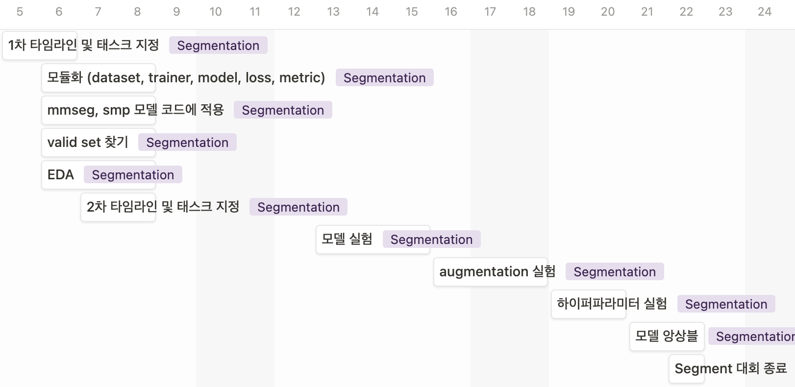
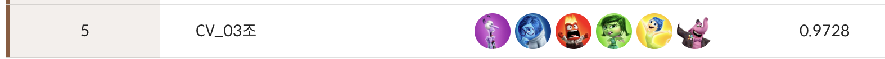
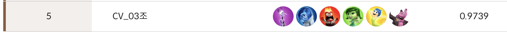

# Segmentation 프로젝트

## 😊 팀 구성원
<div align="center">
<table>
  <tr>
    <td align="center"><a href="https://github.com/hyunseo-k"><br /><sub><b>강현서</b></sub><br />
    </td>
        <td align="center"><a href="https://github.com/Jungtaxi"><br /><sub><b>김정택</b></sub><br />
    </td>
        <td align="center"><a href="https://github.com/jinjero"><br /><sub><b>박진영</b></sub><br />
    </td>
        <td align="center"><a href="https://github.com/rudeuns"><br /><sub><b>선경은</b></sub><br />
    </td>
        <td align="center"><a href="https://github.com/rsl82"><br /><sub><b>이선우</b></sub><br />
    </td>
        <td align="center"><a href="https://github.com/ChoeHyeonWoo"><br /><sub><b>최현우</b></sub><br />
    </td>
  </tr>
</table>
</div>

<br />

## 😷 프로젝트 개요
뼈는 우리 몸의 구조와 기능에 중요한 영향을 미치기 때문에, 정확한 뼈 분할은 의료 진단 및 치료 계획을 개발하는 데 필수적입니다.
Bone Segmentation은 인공지능 분야에서 중요한 응용 분야 중 하나로, 특히, 딥러닝 기술을 이용한 뼈 Segmentation은 많은 연구가 이루어지고 있으며, 다양한 목적으로 도움을 줄 수 있습니다.

<br />

## 📅 프로젝트 일정
프로젝트 전체 일정

- 2024.02.07 ~ 2024.02.22

프로젝트 세부 일정


<br />

## 🏆 프로젝트 결과
- Public 리더보드 결과


<br />

- Private 리더보드 결과


<br />

## 📁 데이터셋 구조
```
📦datasets
 ┣ 📂train
 ┃ ┣ 📂DCM
 ┃ ┗ 📂outputs_json
 ┣ 📂train_resolx2
 ┃ ┗ 📂DCM
 ┣ 📂test
 ┃ ┗ 📂DCM
 ┣ 📂train_mmap
 ┣ 📂mask_bin
 ┣ 📜image_dict.pickle
 ┣ 📜image_name.pickle
 ┗ 📜label_name.pickle
```
이 코드는 `부스트캠프 AI Tech`에서 제공하는 데이터셋으로 다음과 같은 구성을 따릅니다.
- train: 학습에 사용하는 데이터셋
- test: 평가에 사용하는 데이터셋
- train_resolx2: 학습데이터를 Real-ESRGAN을 사용하여 upscaling 후 다시 원본 사이즈로 만든 데이터셋
- train_mmap: numpy.memmap 기능을 활용한 이미지 파일 데이터셋
- mask_bin: 데이터셋의 모든 mask 이미지를 bin으로 압축하여 저장한 데이터셋
- image_dict.pickle : 데이터셋 사용에 필요한 정보를 담고 있는 pickle 파일
- image_name.pickle : image 경로에 대한 정보를 가지고 있는 pickle 파일
- label_name.pickle : label 경로에 대한 정보를 가지고 있는 pickle 파일

<br />

## 📁 프로젝트 구조
```
📦level2-cv-semanticsegmentation-cv-03
 ┣ 📂.git
 ┣ 📂.github
 ┣ 📂EDA
 ┣ 📂Real-ESRGAN
 ┣ 📂base
 ┣ 📂data_loader
 ┣ 📂logger
 ┣ 📂model
 ┣ 📂trainer
 ┣ 📂utils
 ┣ 📜.gitignore
 ┣ 📜.pre-commit-config.yaml
 ┣ 📜README.md
 ┣ 📜config.json
 ┣ 📜config_fast.json
 ┣ 📜config_logit.json
 ┣ 📜config_pseudo.json
 ┣ 📜config_smp.json
 ┣ 📜inference.py
 ┣ 📜parse_config.py
 ┣ 📜requirements.txt
 ┣ 📜train.py
 ┣ 📜train_fast.py
 ┣ 📜train_pseudo.py
 ┗ 📜validation.py
```

#### 1) `EDA/`
- grad_cam, visulize 등이 구현되어 시각화 기능을 제공합니다.
#### 2) `Real-ESRGAN/`
- Super Resolution을 진행한 라이브러리입니다.
#### 3) `base/`
- 모델과 트레이너의 기본 클래스 및 공통 인터페이스를 정의합니다.
#### 4) `data_loader/`
- 학습 타입별로 데이터를 로딩하고 전처리하는 기능을 담당합니다.
#### 5) `logger/`
- wandb logger, 학습 logging, tensorboard가 구현되어 학습 정보를 기록하고 추적합니다.
#### 6) `model/`
- 라이브러리별 모델이 구현되어 있습니다.
#### 7) `trainer/`
- loss, metric, trainer가 구현되어 모델 학습, 검증, 테스트 과정을 관리하고 실행합니다.
#### 8) `utils/`
- mmap, bin, ensemble 등이 구현되어 학습에 필요한 파일 생성 및 유틸리티 함수를 제공합니다.
#### 9) `parse_config.py`
- config.json을 내용을 파싱하여 파라미터를 연결합니다.
#### 10) `config.json`
- 학습에 관련된 파라미터를 설정하는 파일입니다.
#### 11) `train.py`
- config.json의 내용을 기반으로 학습을 진행합니다.
#### 12) `inference.py`
- test 데이터에 대해서 inference를 진행하고 결과를 rle형식으로 변환하여 csv를 저장합니다.
#### 13) `validation.py`
- validation을 진행하여 dice 결과를 출력하고 rle형식으로 변환하여 csv를 저장합니다.


<br />

## ▶️ 실행 방법

#### Train
`python train.py --config [config path]`

#### Inferecne
`python inference.py --config [config path]`

<br />

## ✏️ Wrap-Up Report
- [Wrap-Up Report](https://github.com/boostcampaitech6/level2-cv-semanticsegmentation-cv-03/blob/main/docs/Segmentation-Project-cv3-Wrap-up-Report.pdf)


