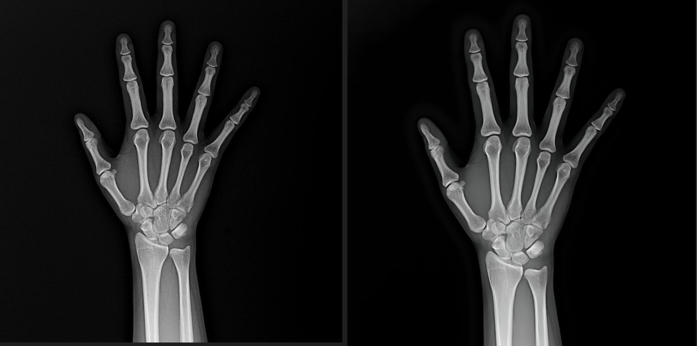
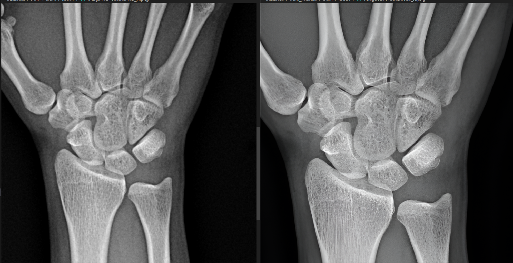
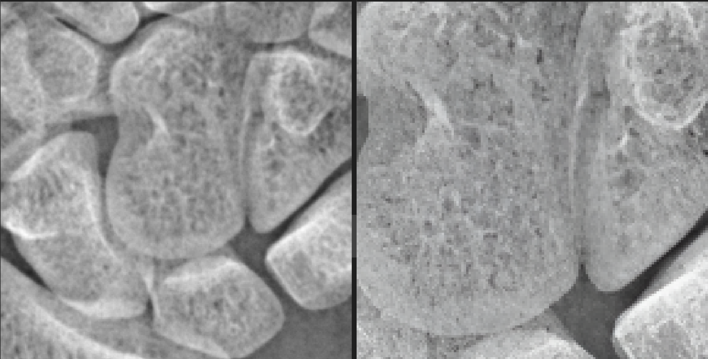

<p align="center">
  
</p>

# Hand Bone Project

## Install
```
cd Real-ESRGAN
pip install basicsr
# facexlib and gfpgan are for face enhancement
pip install facexlib
pip install gfpgan
pip install -r requirements.txt
python setup.py develop
```
## Model
- https://github.com/xinntao/Real-ESRGAN/blob/master/docs/model_zoo.md
- [RealESRGAN_x2plus](https://github.com/xinntao/Real-ESRGAN/releases/download/v0.2.1/RealESRGAN_x2plus.pth)

## Super Resolution 실행
```
python handbone_super_resolution.py
```
- IMAGE_ROOT : /data/ephemeral/home/datasets/train/DCM
- SAVE_IMAGE_ROOT: 저장할 dir
- model path를 위의 다운받은 모델의 위치로 수정

## Origin V.s. Super Resolution 2x




## BibTeX

    @InProceedings{wang2021realesrgan,
        author    = {Xintao Wang and Liangbin Xie and Chao Dong and Ying Shan},
        title     = {Real-ESRGAN: Training Real-World Blind Super-Resolution with Pure Synthetic Data},
        booktitle = {International Conference on Computer Vision Workshops (ICCVW)},
        date      = {2021}
    }